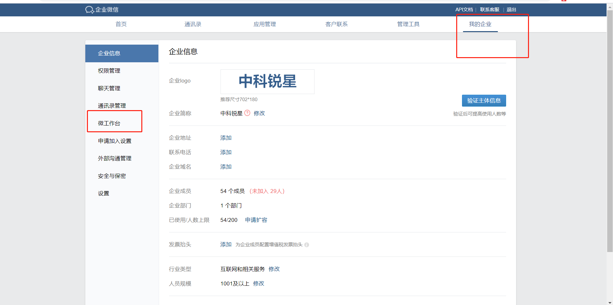

#### Vant 在企业微信的调试工具
##### 1、进入企业微信入口
```https://work.weixin.qq.com/wework_admin/loginpage_wx?from=myhome```
##### 2、找到 "我的企业" -- "微工作台" --"开发者工具"
###### setp1:


###### setp2:


这是有赞官网[Vant官网](https://youzan.github.io/vant/#/zh-CN/quickstart "Vant官网"). 


<template>
  
</template>

<script>
// @ is an alias to /src

import pic from '../assets/logo.png'
export default {
  name: 'Home',
  components: {
    
  },
  methods:{
      clickFn(){
          alert('aa')
      }
  }
}
</script>
<style>
  .card{
    margin:auto;
    width: 600px;
    text-align: center;
  }
</style>
